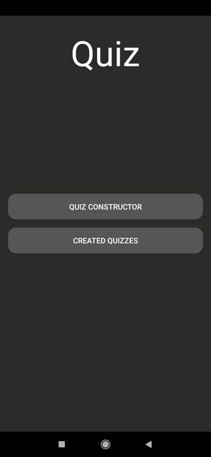
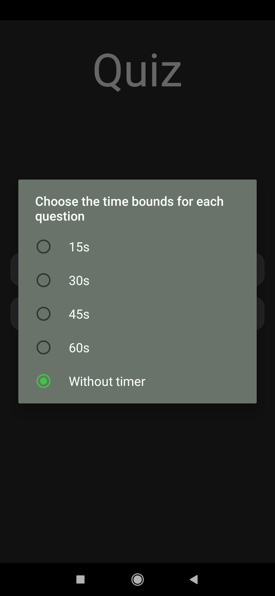
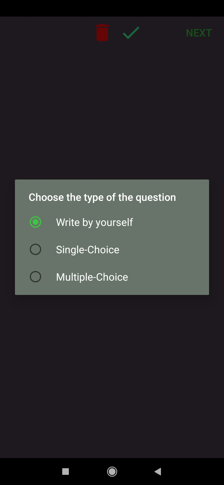

# Quiz_Project

## Idea of the application:
1. Create an app like Kahoot
2. Ability to create quizzes
3. Share them
4. The ability to pass them and see your result

## Animation

## Ability to select time for all questions

## Ability to choose the type of the question

## Ability to fill up the question and answers fields

## Display all previously created quizzes

# Further improvements:

1) Create an ability to share (create an instance of quiz in Firebase) quizzes to other people
2) Create an ability to select the right answer by the owner/creator of the quiz
3) Create a possibility to answer this questions and displaying the results(for the respondent and the owner)
